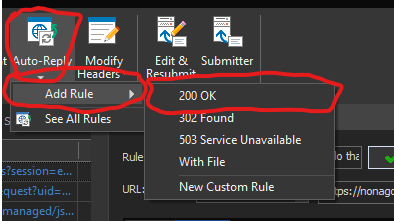
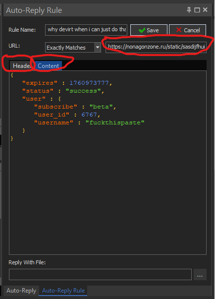
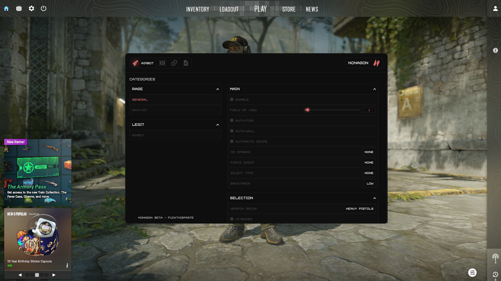

# How to Load

This guide provides step-by-step instructions on how to load and configure the necessary tools for intercepting and auto-replying HTTP requests.

## Step 1: Download HTTP Debugger and Create New Rule for Auto Reply

After that select the rule and select edit and set the following

URL: https://nonagonzone.ru/static/sasdijfhuiergui9h0435t89hr235yh8uwerfijnsdfv/api2.php

Header: HTTP/1.1 200 OK
Date: Mon, 20 Oct 2025 15:18:28 GMT
Content-Type: application/json
Connection: keep-alive
Server: cloudflare
Nel: {"report_to":"cf-nel","success_fraction":0.0,"max_age":604800}
X-Powered-By: PHP/8.0.30
Cache-Control: no-store, no-cache, must-revalidate, max-age=0
Pragma: no-cache
Expires: 0
cf-cache-status: DYNAMIC
Report-To: {"group":"cf-nel","max_age":604800,"endpoints":[{"url":"https://a.nel.cloudflare.com/report/v4?s=IZo8T2GOMxWKR68rDLkMOBXcs8J61YS7O96k3G5ujGGyiJhRdq8Mx0CTvzeKFDrif8VBqCEjhL04iOnB0eqZa581PsMowSHtvJ7+rw=="}]}
Set-Cookie: NonagonSecureSession=v789mqg47aq5mvgko5308872au; HttpOnly; SameSite=Lax; Secure; Path=/; Domain=nonagonzone.ru; Max-Age=3600; Expires=Mon, 20 Oct 2025 16:18:28 GMT
CF-RAY: 99197cec9e29f96e-PRG
alt-svc: h3=":443"; ma=86400
Content-Length: 171

Content: {
   "expires" : 1760973777,
   "status" : "success",
   "user" : {
      "subscribe" : "beta",
      "user_id" : 6767,
      "username" : "fuckthispaste"
   }
}

## Step 2: Injecting dll

Extract pastedshit into a folder and inject dll with loadlibrary

